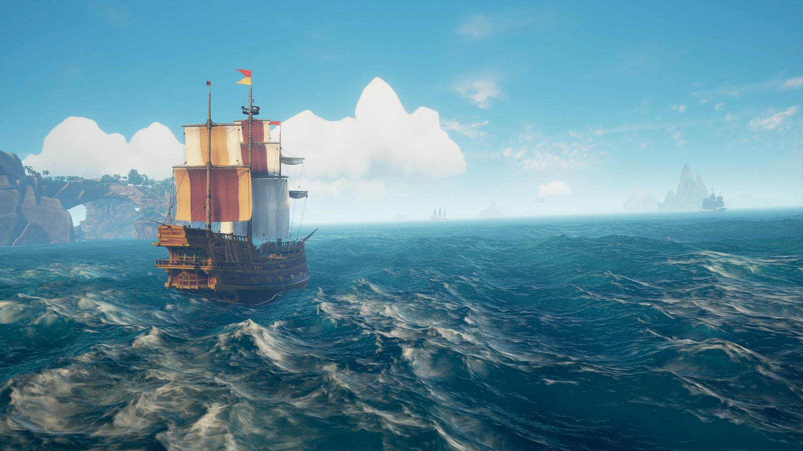
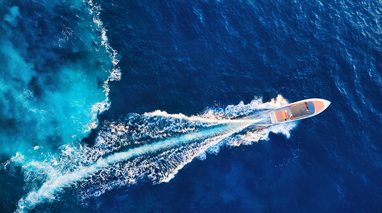

{width="900px"}

# Summary

The goal of the project is to create an interactive scene of a boat floating in the ocean. More specifically, we want to be able to have an infinite ocean, dynamically change the weather conditions (calm sea vs storm), steer the boat and ideally have realistic water-boat interactions, such as wave generation and water spashes.

# Goals and Deliverables

Describe the goals of your project here, following the
[project instructions](https://courses-gcm.epfl.ch/icg2023/project/instructions/).

Core project:

 * Wave generation: height and frequency of waves, simulating different waves under various weather conditions (make interactive).
 * Boat that you can steer.

The final scene will be something similar to the above picture and will be interactive boat movement and different wave generation.

Extras:

 * Sun reflections on waves.
 * White water foam on waves, that depend on the weather condition (research on formulas)
 * Boids (old technique for bird simulations)
 * The realistic boat-water interaction.
 * Weather simulation: rains, cloudy, lighting

 {width="500px"}

# Schedule

All members will work on different parts of the project, the allocation is just primary member that may take the heavy lift of certain goal.

## Week 1: 24-30 April

 * Project proposal review, change project deliverables if needed after feedback, read on related papers and new framework.

    Work allocation: The whole team.

## Week 2: 1-7 May

 * Familliarise with godot
 * Try out different wave generation techniques
 * A boat with simple steering
 * Have a first result

  Work allocation: 
    All members collaborate to get a nice result. 
    Jonas works on the boat. 
    The rest work on the wave generation. 

## Week 3: 8-14 May

 * Finalising the wave generation functionality.
 * UI to dynamically change wave generation variables
 * Boat physics (realistic buyancy)

Work allocation: 
Core part: all members 
Boat: Jonas 
UI: Jonas 
Weather Simulation: Toni 
Water Foam: Nephele 

## Week 4: 15-21 May

 * Work on extras, solve any problems.

## Week 5: 22-28 May

 * Work on extras, solve any problems.

## Week 6: 29 May - 4 June

* Make video, everyobody works to finalize report.

# Resources

We consider making the demo in Godot, an open-source game engine.

We believe that in order to make our project look really realistic and interactive, we need a solid framework.

Some research we have done:

 *